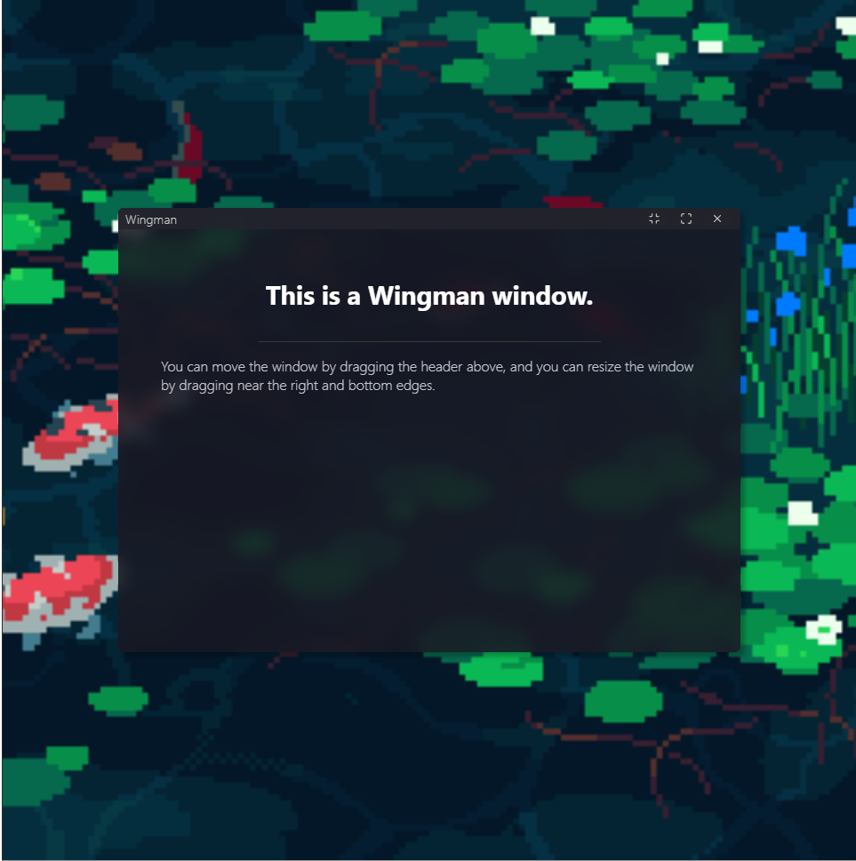
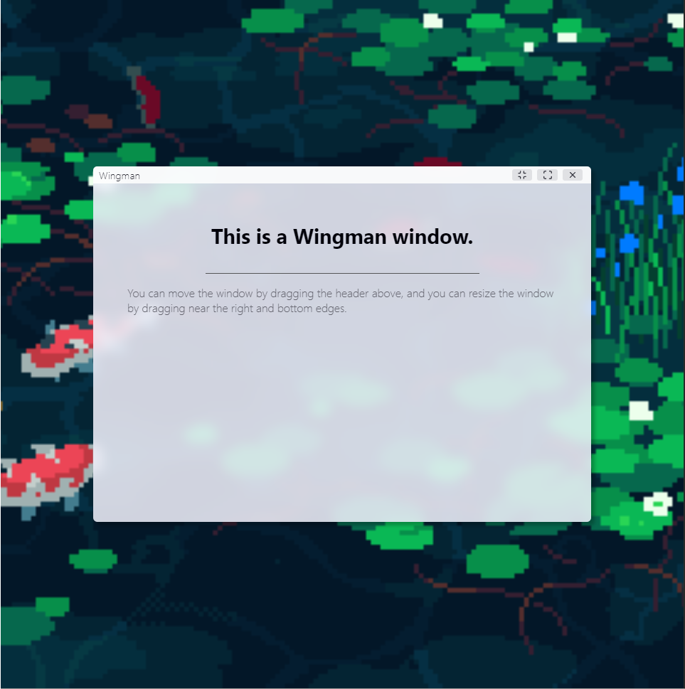

# Wingman

An extensible HTML DOM window manager with a professional look and feel.


<br />


## Installation
Wingman only requires two files: `wingman.css` and `wingman.js`.

`wingman.css` is the CSS styling for windows, and can be fully customized to fit your needs.
`wingman.js` is the JavaScript class for managing windows.

```html
<!-- Put this in your <head> tag -->
<link rel="stylesheet" href="./wingman.css" />

<!-- Put this at the end of your <body> tag -->
<script src="./wingman.js"></script>
```

## Usage
To create a new window, simply create a new `Wingman` class instance.

Windows usually are `HTMLDivElement`s, though most other container elements will work.

To add content to a window, simply put your HTML inside the root window element. It will be stored in the new window.

```js
// Default window configuration
const defaultWindow = new Wingman('#window', // the CSS selector of the element to turn into a window.
{
    width: 700,       // width of the window
    height: 500,      // height of the window
    minWidth: 500,    // minimum width of the window
    minHeight: 400,   // minimmum width of the window
    draggable: true,  // whether or not you can drag the window by its header
    resizable: true,  // whether or not you can resize a window
    centered: true,   // whether or not to spawn this window in the center of its parent
    darkMode: true,   // whether or not to spawn this window in dark mode (false = light mode)
    shadow: 'hover',  // the type of window shadow ['always', 'hover', 'active', 'none']
    title: 'Wingman', // the title of this window
    debug: true       // whether or not to display more window information in the console
});
```

## Logging
Wingman has a dedicated logging system, and is fully customizable. Styles for the logger are located within `wingman.js`.

## License
Wingman is licensed under the MIT license.

```
MIT License

Copyright (c) 2022 nethe550

Permission is hereby granted, free of charge, to any person obtaining a copy
of this software and associated documentation files (the "Software"), to deal
in the Software without restriction, including without limitation the rights
to use, copy, modify, merge, publish, distribute, sublicense, and/or sell
copies of the Software, and to permit persons to whom the Software is
furnished to do so, subject to the following conditions:

The above copyright notice and this permission notice shall be included in all
copies or substantial portions of the Software.

THE SOFTWARE IS PROVIDED "AS IS", WITHOUT WARRANTY OF ANY KIND, EXPRESS OR
IMPLIED, INCLUDING BUT NOT LIMITED TO THE WARRANTIES OF MERCHANTABILITY,
FITNESS FOR A PARTICULAR PURPOSE AND NONINFRINGEMENT. IN NO EVENT SHALL THE
AUTHORS OR COPYRIGHT HOLDERS BE LIABLE FOR ANY CLAIM, DAMAGES OR OTHER
LIABILITY, WHETHER IN AN ACTION OF CONTRACT, TORT OR OTHERWISE, ARISING FROM,
OUT OF OR IN CONNECTION WITH THE SOFTWARE OR THE USE OR OTHER DEALINGS IN THE
SOFTWARE.
```
